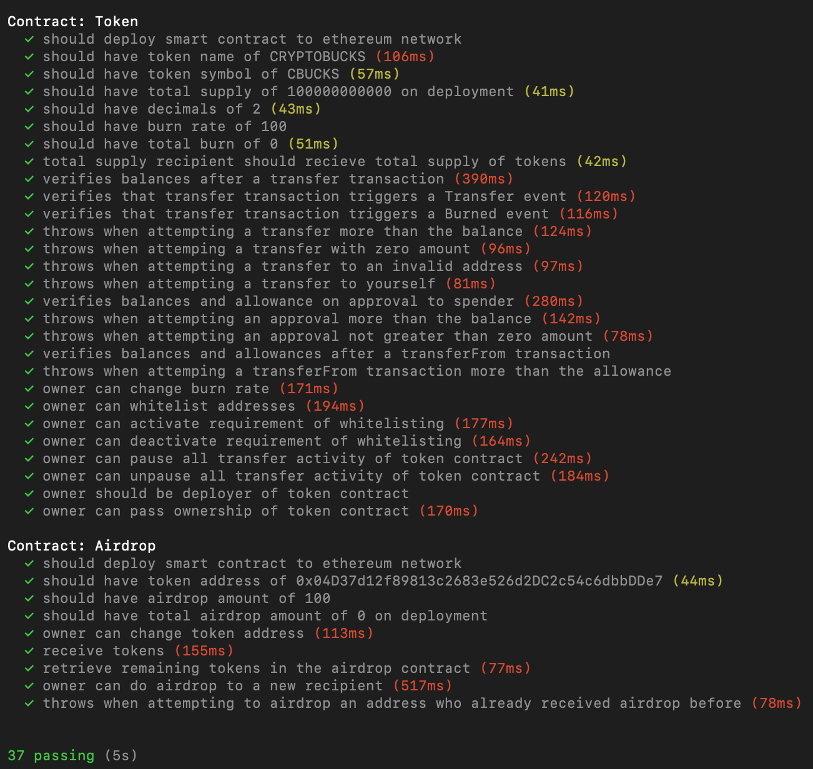

# CRYPTOBUCKS

Cryptobucks is a peer to peer platform that gives you an easy and quick way to buy and sell bitcoin and copytrade using blockchain. Our wallet platform uses cold storage Nano X Ledgers to guarantee the safety of the bitcoins  . We offer an easy user experience for securely making peer to peer transactions by making copytrading software on blockchain. By doing so, this will definitely increase efficiency, transparency, and maximize profitability.

## Contracts
1. Token.sol - CBucks ERC20 compliant token
2. Airdrop.sol - Handles CBucks airdrops prevents spamming

## Tests

## Contact
Email us at cbucks.blockchain@gmail.com with any questions and feedback!